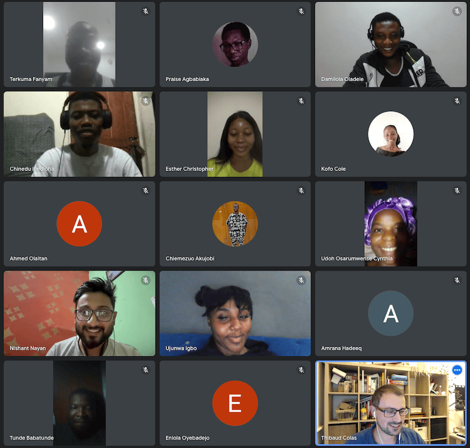

# Case study: Create Wagtail developer onboarding tutorials

Organization or Project: [Wagtail](https://wagtail.org/), see [Google Season of Docs 2023 overview for Wagtail](https://github.com/wagtail/gsod/blob/main/2023/README.md).

Organization Description: Wagtail is a popular content management system (CMS). It's built on Python by an active and engaged open source community, which has grown rapidly since Wagtail's release in 2014. Wagtail is available in over 40 languages. It is used by some of the world's best-known organizations, including NASA, Google, Mozilla, MIT, and the UK's National Health Service.

Authors: Thibaud Colas ([@thibaudcolas](https://github.com/thibaudcolas)), Meagen Voss ([@vossisboss](https://github.com/vossisboss))

## Problem Statement

_What problem were you trying to solve with new or improved documentation? Link to the proposal page on your project site, if possible._

We had three problems we tried to solve with this project, which we surfaced as challenges in [our proposal](proposal-create-wagtail-developer-onboarding-tutorials.md):

1. **A lacklustre "first-time" learning experience for our users.**
   This was identified as part of our [product vision for 2023](https://wagtail.org/blog/wagtail-vision/), as the umbrella goal "First 30 minutes of Wagtail".
   A key problem here was third-party tutorials easily falling out of date.
2. **Our users having trouble with _deployment_ specifically.**
   We learned this from informal feedback, and from our own experience. We confirmed more specific challenges in our [2023 Wagtail deployment survey](https://wagtail.org/blog/2023-wagtail-deployment-survey/).
3. **A lack of reliable resources we could send to people who are new to tech.**
   Developers in our community are regularly involved with initiatives like Google Summer of Code, Outreachy, Django Girls.
   In those scenarios, we need learning material that’s approachable for newcomers, reliable, well-maintained.

We acutely felt all three of those pain points as part of our participation to outreach programs, where we have a sudden influx of people generally new to Wagtail and all looking to get up to speed with how our product works. As an illustration, the influx of new users is very clear when looking at weekly active members on our Slack workspace, which is our community’s main communication channel:

[](./assets/weekly_active_members_on_the_wagtail_slack_workspace.png)

Here we can see how the number of people posting increases a lot, occasionally doubling, as part of Google Summer of Code 2022 and 2023, and Outreachy October 2022 and 2023 cohorts.

## Proposal Abstract

_A brief summary of your original organization proposal. Link to the proposal page on your project site, if possible._

[Our proposal](proposal-create-wagtail-developer-onboarding-tutorials.md) is to create a new official tutorial series, bridging the gap between our existing ["Your first Wagtail site" tutorial](https://docs.wagtail.org/en/latest/getting_started/tutorial.html) and our full-fledged [bakery demo website](https://github.com/wagtail/bakerydemo), and including deployment. This new series will help our users get a better understanding of Wagtail. It will help our contributors by having a reliable, always up-to-date resource to give newcomers.

## Project Description

### Creating the proposal

_How did you come up with your Google Season of Docs proposal? What process did your organization use to decide on an idea? How did you solicit and incorporate feedback?_

We’ve only recently realized how essential technical writers are to our community. In June 2022, we hired Meagen Voss, our first [Community and partnerships manager](https://wagtail.org/blog/partnerships-and-community-manager/) and an experienced writer.
Later in the year, we decided to organize a documentation project as one of [three Outreachy internships](https://wagtail.org/blog/outreachy-welcoming-new-contributors-to-open-source/).
Having those people involved with our community helped us identify gaps in our current documentation efforts, and actually go about solving them.
They also helped us identify opportunities like Season of Docs, and come up with a reasonable brief for a technical writer.

The specific idea had been initially identified back in our 2021 [documentation sprint](https://wagtail.org/blog/documentation-sprint-2021/), where we did an audit and re-organizing of our documentation according to the [Diátaxis](https://diataxis.fr/) approach.
Tutorial resources were the most obvious gap.

With the fundamental concept well validated already, we went to our core team and other stakeholders to confirm the plans to write [our Season of Docs proposal](proposal-create-wagtail-developer-onboarding-tutorials.md).
We didn’t spend too much time on the details of the plan, aside from being clear on goals: better resources for outreach programs, reasonable maintenance effort, text format.

### Budget

_Include a short section on your budget. How did you estimate the work? Were there any unexpected expenses? Did you end up spending less than the grant award? Did you allocate funds properly or were some items you budgeted for more/less/unnecessary? Did you have other funds outside of Google Season of Docs that you were able to use?_

With our uneven amount of experience working with technical writers, we kept estimates very simple.
We decided to focus on the lowest grant possible from Season of Docs of $5,000, and assess with technical writers how much progress could be made on the tutorial series based on that budget.
After general consensus that this was doable, we proceeded with the proposal.

We had a few unforeseen costs which we could have identified sooner:

- Payment processing fees.
  We didn’t realise how much it would cost our writer to get paid.
  Close to 5% of their first $2000 payment went towards bank transfer fees.
- Testing devices.
  It’s fundamental our tutorial works well on Windows, and our community primarily works on macOS and Linux.
  We decided to procure a Windows "remote desktop" computer from [Shadow](https://shadow.tech/), at a cost of $10/month for 3 months.
  We’ve yet to confirm which budget might cover this cost.

With $5000 going to our writer, we also requested $250 to compensate people testing our tutorial.
We’ve not used those funds yet, but still have plans to.
We were hoping to work with five people in this way, but the amount we’ve allocated seems too low for us justify the time and cost of making payments.
We’ve been hoping to resolve this by working with 5 people already involved with an outreach program, such as Django Girls or Outreachy.
We could donate the full $250 to said program in one go, rather than compensating testers individually.

Finally, this is a small expense but highly symbolic one for us – we were lucky to [attend the GSoC Mentor Summit](https://wagtail.org/blog/collaborating-with-other-maintainers-at-the-gsoc-mentor-summit/) earlier this year.
Our representatives gathered a few bits of Google Open Source and Season of Docs swag, which we’d like to send to our writer.
We’ve not identified budget for this yet (on the order of $30).

### Participants

_Who worked on this project (use usernames if requested by participants)? How did you find and hire your technical writer? How did you find other volunteers or paid participants? What roles did they have? Did anyone drop out? What did you learn about recruiting, communication, and project management?_

Our participants are:

- Damilola Oladele ([@activus-d](https://github.com/activus-d)), technical writer.
- Meagen Voss ([@vossisboss](https://github.com/vossisboss)), Wagtail core team member and community manager. Project manager / product owner and editor for this project.
- Thibaud Colas ([@thibaudcolas](https://github.com/thibaudcolas)), Wagtail core team member and developer. Project manager / product owner and developer for this project.

#### Hiring process

Meagen and Thibaud initiated the project proposal with the support of Wagtail’s core team.
We had already worked with Damilola on a previous project, which was crucial in selecting him as a technical writer.
We had 12 writer applications for this role, but only two that we felt able to consider seriously (the other ten felt like people who didn’t really have professional technical writing experience).
We worried about the level of ability needed with Django and Wagtail to deliver this project, which made us hesitant to hire someone completely new to our community.

To finish the hiring process, we wrote our [Wagtail technical writer agreement](2023-technical-writer-agreement.md) as a form of contract to make sure we were on the same page on key aspects of the project.
Here is the outline of the writer agreement as a summary:

- [Scope of work](2023-technical-writer-agreement.md#scope-of-work)
- [Deliverables](2023-technical-writer-agreement.md#deliverables)
  - [Audit of the existing tutorial](2023-technical-writer-agreement.md#audit-of-the-existing-tutorial)
  - [New tutorial series](2023-technical-writer-agreement.md#new-tutorial-series)
  - [Tutorial refinements](2023-technical-writer-agreement.md#tutorial-refinements)
- [Proposed timeline](2023-technical-writer-agreement.md#proposed-timeline)
- [Licensing and copyright](2023-technical-writer-agreement.md#licensing-and-copyright)
- [Methodology and revisions](2023-technical-writer-agreement.md#methodology-and-revisions)
- [Communication and project management](2023-technical-writer-agreement.md#communication-and-project-management)
  - [Project participants](2023-technical-writer-agreement.md#project-participants)
- [Compensation](2023-technical-writer-agreement.md#compensation)
  - [Invoices](2023-technical-writer-agreement.md#invoices)

---

With more experience working with technical writers, we believe it will be easier to hire someone new to Wagtail in the future.
We’re also now more aware of online spaces like [Write the Docs](https://www.writethedocs.org/) where we will have more luck advertising similar projects in the future.

#### Supporters

Our team additionally received support from Storm and Kalob, who helped set up and review parts of the tutorial’s coding content:

- Storm Heg ([@Stormheg](https://github.com/stormheg)), Wagtail core team member and developer
- Kalob Taulien ([@KalobTaulien](https://github.com/KalobTaulien)), Wagtail core team member and developer

Both Storm and Kalob made themselves available on short notice when it was clear we needed more help to review our project’s code snippets.

Rachel Smith ([@rachelhsmith](https://github.com/rachelhsmith)) additionally helped by being the first person outside the team to test the tutorial.
And Wagtail’s [Developer relations team](https://github.com/wagtail/wagtail/wiki/Developer-relations-team) has regularly reviewed the project and provided high-level guidance.

Finally, we’ve been working with representatives of [Fly.io](https://fly.io/).
We selected this platform for deployment of the site, and have been working with them to ensure the tutorial works well there.

As of November 2023, we’re also still looking for five additional participants – testers for the tutorial’s contents.

### Timeline

_Give a short overview of the timeline of your project (indicate estimated end date or intermediate milestones if project is ongoing). Did the original timeline need adjustment?_

Our [original timeline](proposal-create-wagtail-developer-onboarding-tutorials.md#timeline) was:

- **May**: Orientation.
- **June**: Audit and revise existing Get Started tutorial. Review existing demo site code and outline tutorial documentation required to teach people to build it.
- **July-October**: Draft tutorial sections. Recruit testers and revise tutorial documentation accordingly.
- **November**: Project wrap-up and promotion of new documentation within the Wagtail community.

We’ve been roughly one week behind schedule during the first half of the project, and now about 2 weeks behind schedule.
There are three milestones still outstanding:

1. _Recruit testers and revise tutorial documentation accordingly._ This will happen in December 2023. We have an ideal plan, and a backup plan to guarantee this is done by the end of the year.
2. _Promotion of new documentation within the Wagtail community_. The tutorial has been published and "soft-launched". We will prepare promotion materials in December 2023, and promote the tutorial in February 2024 (aligning with other organization milestones).
3. _Project wrap-up._ Though the tutorial is published, we can’t consider this fully wrapped up until the feedback phase is over.

The main reasons for the delays are due to us not validating our plans for the second half of the project early enough.
In particular, we didn’t confirm whether our plan to recruit testers was viable until we needed to start recruiting.
We also didn’t realize how big of a dependency we had on picking a deployment platform for the tutorial, and how much testing would be needed to ensure it all worked well.

### Results

_What was created, updated, or otherwise changed? Include links to published documentation if available. Were there any deliverables in the proposal that did not get created? List those as well. Did this project result in any new or updated processes or procedures in your organization?_

As per our main goals, we’ve created and published a whole new tutorial series, [Wagtail docs – Tutorial](https://docs.wagtail.org/en/latest/tutorial/index.html). Hooray! 🌈
The new tutorial series is currently in "soft launch" or available as a "pre-release" – it’s live on our documentation site, but only within the "latest" version of our documentation which users have to opt into using.
The tutorial series will go live for all users in February 2024, when we release Wagtail 6.0.

We also have a revamped initial [Your first Wagtail site](https://docs.wagtail.org/en/latest/getting_started/tutorial.html) tutorial.
It’s more beginner-friendly, particularly for people completely new to both Django and Wagtail.
Here is a screenshot of the homepage for a site built with the whole series, as an illustration:

[](./assets/screenshot_of_the_portfolio_website_homepage_with_content_from_thibaud_with_a_pineapple_mug.png)

On here, we can see glimpses of most major improvements brought by this new series:

1. All of the site’s pages have a basic layout, which makes the site more compelling while not being a distraction from Wagtail learnings.
2. The site’s pages all have a header and a footer, with content fully managed in the CMS.
3. The homepage has structured content, not just a title and "body" field.
4. We have a "Contact us" page to demonstrate custom forms
5. And a "Projects and skills" portfolio page to demonstrate more complex content.
6. And site search

#### Demo site

Though this isn’t a direct deliverable of the project, we also currently host a live version of the site created as part of the tutorial as a demo: <https://your-wagtail-portfolio.fly.dev/>.

Though the tutorial itself wasn’t ready, we were actually able to use this site as part of the Outreachy application period in October 2023.
Trying out Wagtail was one of the ["Getting to know the project" tasks](https://github.com/wagtail/outreachy/blob/main/contributor-guide.md#checklist-accessibility-features-documentation) we had defined for applicants to our documentation project, [Accessibility features documentation](https://github.com/wagtail/outreachy/blob/main/project-ideas.md#accessibility-features-documentation).
This was the first experience with Wagtail for 18 people as part of that cohort. We gave them access to a live copy of the site, and Damilola and Thibaud presented Wagtail to those 18 people with this site as the demo:

[](./assets/damilola_and_thibaud_with_outreachy_participants.png)

If you want to try out the CMS, head to <https://your-wagtail-portfolio.fly.dev/admin/login/>, with username `seasonofdocs` and password `antarctica`.

#### Methodology and processes

##### Tutorial maintenance

As part of this project, thinking of new processes, we’ve also added [support for custom project templates to our `wagtail start`](https://docs.wagtail.org/en/latest/releases/5.1.html#custom-template-support-for-wagtail-start) command.
This allows us to complete this project with two new deliverables which will simplify maintenance of this tutorial series:

- Creating [the solution to "Your first Wagtail site"](https://github.com/wagtail/your-first-wagtail-site) as a [reusable template](https://github.com/thibaudcolas/wagtail-tutorial-template). The template exists and works, we just need to determine where best to publish it and how to name it.
- Creating a template for the new full tutorial series. This is a work in progress, and will be completed in December 2023 (once we’ve gathered enough feedback).

Those two deliverables will simplify maintenance by having a clear place where Wagtail maintainers can track compatibility of the tutorials with new releases, and test them in a matter of minutes.

We’ve also made two other changes to help with onboarding of future technical writers:

- We now have a style guide documented as part of our [documentation guidelines](https://docs.wagtail.org/en/latest/contributing/documentation_guidelines.html#writing-style-guide).
- We’ve switched to [American English for documentation](https://docs.wagtail.org/en/stable/contributing/general_guidelines.html#language), as opposed to British English. We hope this will allow a broader audience to contribute without getting distracted by spelling.

##### Future documentation projects

For other documentation projects, we also expect to be reusing two different methodologies / document templates which we got to spend time with on the tutorial:

1. A skills map and gap analysis, as demonstrated in our [Wagtail skills analysis](./deliverables/wagtail-skills-analysis.md).
   This helped us determine what skills were required in existing resources, to determine which ones should be covered in our new tutorial.
2. A friction log, as demonstrated in our [Wagtail tutorials common issues](./deliverables/wagtail-tutorials-common-issues.md).
   This is a well-established methodology, but still relatively new to us.

Additionally, we see ourselves reusing a lot of aspects coming straight from Season of Docs. Specifically:

1. Establishing metrics for documentation projects.
2. Writing a technical writer brief and agreement.

#### In progress: Tutorial content

As part of the final weeks of this project in December, there are a few more deliverables we’re working on:

- A set of tutorial content updates to some or all of 6 "quick wins" identified in our [Gap analysis post-release of the new tutorial](deliverables/wagtail-skills-analysis.md/#gap-analysis-–-with-new-tutorial).
- Two screenshots we’d like to add to the tutorial, to make it easier to follow.
  This took longer than expected due to our process to keep documentation screenshots up-to-date from release to release.
- Better support for Windows in the last Deployment step specifically, where we’re working with [Fly.io](https://fly.io/) on possible improvements.
- (Any other updates from the still-in-progress feedback process)

#### In progress: Tutorial feedback

The biggest gap compared to our initial plans is tutorial feedback, where we expected 5 people to have provided us with feedback by the end of the project.
As of November 20th, we have received feedback from one person.
This is mostly a question of sub-par planning on our part, and delays of a few weeks compared to our timeline.

Our ideal plan to catch up has been to reach out to [Django Girls](https://djangogirls.org/) organizers, to check whether they would be ok with us reaching out to past Django Girls participants to try out our tutorial, with a donation to the program as a form of compensation.
If this doesn’t work out, we have a few other options:

- A group of five students from [IMT Atlantique](https://www.imt-atlantique.fr/) have reached out, with an assignment to contribute to open source in December.
  Them going through the tutorial, providing feedback, and possibly making edits themselves would make for a solid open source contribution.
- We already have 10 or so people expressing an interest in joining Wagtail for [Google Summer of Code](https://summerofcode.withgoogle.com/) in 2023.
  We could ask them whether they would be up for contributing to Wagtail ahead of GSoC in this way.

We also have two further contingency plans:

1. Advertising our call for feedback at an online meeting for new contributors on November 29th.
2. Advertising our call for feedback in our weekly newsletter going out in early December.

Finally, since we knew this would be an issue approaching November, we did try to streamline this feedback process as much as possible by setting up:

1. A [tutorial feedback form](./deliverables/tutorial-feedback-form.md) tailored for the type of information we’re after.
1. A [tutorial feedback template](./deliverables/tutorial-feedback-template.md) document, with tutorial sections clearly listed, for people who want to provide specific feedback.

Update March 2024: from our tutorial feedback form, on "How would you rate the tutorial overall?" – average score of 8.6/10.

### Metrics

_What metrics did you choose to measure the success of the project? Were you able to collect those metrics? Did the metrics correlate well or poorly with the behaviors or outcomes you wanted for the project? Did your metrics change since your proposal? Did you add or remove any metrics? How often do you intend to collect metrics going forward?_

We planned to use three metrics, and still believe they are the right fit:

- Total number of visitors to each section of the tutorial series
- Percentage of visits to the final tutorial in the series relative to the initial Getting Started tutorial.
- Number of open source newcomers going through the tutorial series as part of our Outreach programs.

There is a fourth metric which could be interesting to track, _tutorial contributions_.

#### Tutorial visitors

The specific goals we had to consider this project successful were:

- At least 50% of visitors to the Getting Started tutorial continue on to the next tutorial in the new onboarding series.
- The final tutorial in the series receives at least 20% of the traffic of the initial Getting Started tutorial.

As of November 20th, we do not have this data yet, but we believe it’s only a matter of time.
What we do know is:

- We have about 9000 page views to our existing ["Your first Wagtail site" tutorial](https://docs.wagtail.org/en/stable/getting_started/tutorial.html)
- "50% of visitors continuing to the next tutorial" would mean 4500 page views on the [tutorial series index](https://docs.wagtail.org/en/latest/tutorial/index.html).
- "20% of visitors going all the way to the last step" would mean 1800 page views on the [Deploy your site](https://docs.wagtail.org/en/latest/tutorial/deployment.html) step.

Our documentation hosting platform Read the Docs provides enough analytics data to track those numbers as needed, via the [(access-restricted) Traffic Analytics admin page](https://readthedocs.org/dashboard/wagtail/traffic-analytics/).

Here are our top 10 viewed pages in the past 30 days for reference:

| Page                                                                                                             | Views |
| ---------------------------------------------------------------------------------------------------------------- | ----- |
| [/getting_started/tutorial.html](https://docs.wagtail.org/en/stable/getting_started/tutorial.html)               | 9275  |
| [/index.html](https://docs.wagtail.org/en/stable/index.html)                                                     | 8521  |
| [/topics/pages.html](https://docs.wagtail.org/en/stable/topics/pages.html)                                       | 4763  |
| [/search.html](https://docs.wagtail.org/en/stable/search.html)                                                   | 4009  |
| [/releases/5.2.html](https://docs.wagtail.org/en/stable/releases/5.2.html)                                       | 3876  |
| [/getting_started/index.html](https://docs.wagtail.org/en/stable/getting_started/index.html)                     | 3779  |
| [/reference/pages/panels.html](https://docs.wagtail.org/en/stable/reference/pages/panels.html)                   | 3245  |
| [/topics/streamfield.html](https://docs.wagtail.org/en/stable/topics/streamfield.html)                           | 3147  |
| [/topics/images.html](https://docs.wagtail.org/en/stable/topics/images.html)                                     | 2659  |
| [/reference/pages/model_reference.html](https://docs.wagtail.org/en/stable/reference/pages/model_reference.html) | 2651  |

---

We believe the tutorial will become one of the most popular sections in our documentation and this will show in page views.
There is a chance however that this traffic would come from people who aren’t using our docs currently – so it could be we see an increase in overall page views from the new series, rather than the new series necessarily having a high traffic relative to the current tutorial.

##### Page views for pre-release content

As of December 5th 2023, our tutorial series has been live for 19 days on this pre-release "latest" version of our documentation.
Here are page views for those tutorial pages over _19 days_, ordered by tutorial step:

| Page                                                                                                                       | Views |
| -------------------------------------------------------------------------------------------------------------------------- | ----- |
| [/getting_started/tutorial.html](https://docs.wagtail.org/en/latest/getting_started/tutorial.html)                         | 166   |
| [/tutorial/index.html](https://docs.wagtail.org/en/latest/tutorial/index.html)                                             | 210   |
| [/tutorial/customize_homepage.html](https://docs.wagtail.org/en/latest/tutorial/customize_homepage.html)                   | 123   |
| [/tutorial/create-footer_for_all_pages.html](https://docs.wagtail.org/en/latest/tutorial/create-footer_for_all_pages.html) | 116   |
| [/tutorial/set_up_site_menu.html](https://docs.wagtail.org/en/latest/tutorial/set_up_site_menu.html)                       | 62    |
| [/tutorial/style_your_site.html](https://docs.wagtail.org/en/latest/tutorial/style_your_site.html)                         | 58    |
| [/tutorial/create_contact_page.html](https://docs.wagtail.org/en/latest/tutorial/create_contact_page.html)                 | 57    |
| [/tutorial/create_portfolio_page.html](https://docs.wagtail.org/en/latest/tutorial/create_portfolio_page.html)             | 71    |
| [/tutorial/add_search.html](https://docs.wagtail.org/en/latest/tutorial/add_search.html)                                   | 45    |
| [/tutorial/deployment.html](https://docs.wagtail.org/en/latest/tutorial/deployment.html)                                   | 65    |

From this, we can see that our sharing of the pre-release tutorial has helped with getting users already.
We can also see this data _should_ be a good indication of whether we will meet our goals, once the tutorial is more widely available.

The data is surprising as we would expect for there to be a more gradual drop-off in page views than is shown here, but this will be clearer once there are more data points.

#### Open source newcomers

We were hoping for 50+ open source newcomers to go through the series as part of our next two outreach program participation (Outreachy December 2023, GSoC 2024).

We didn’t have the tutorial ready in time for Outreachy’s October 2023 application period, but we believe it would have been possible to _recommend_ the tutorial to 30 people, with at least 15 going through.
We had [64 people](https://github.com/wagtail/outreachy/discussions/1) express an interest in working with us on three projects.
Two of those projects involved going through our existing tutorial as part of getting to know Wagtail.
For those two projects, we received a total of 18 applications – so 18 people going through our contributor guidelines including following the tutorial.

As part of Google Summer of Code 2024, we believe we will be able to recommend the tutorial to 80-100 people, and hope at least 35 will follow through.
For Summer of Code 2023, we had [85 people](https://github.com/wagtail/gsoc/discussions/1) express an interest in our three projects.
All three projects would have involved going through our tutorial.
We received a total of 35 applications.

---

The threshold of "50" we had initially set is ultimately just a guess. Even if half of applicants through those programs went through the tutorial, it would be a resounding success (so 27 people based on our last two programs).

#### Tutorial contributions

Another metric which would be interesting for us to track: how many people contribute to the tutorial in the future.
Documentation contributions are very popular for people new to open source in particular (as they go through the tutorial to get started).
This has been the case in past outreach programs, see [pull requests tagged "Outreachy" and "Documentation"](https://github.com/wagtail/wagtail/pulls?q=is%3Apr+sort%3Aupdated-desc+label%3AOutreachy+is%3Aclosed+label%3ADocumentation).

Having this tutorial within our first-party documentation will help with keeping it up-to-date, and a side benefit is this source of possible contributions for newcomers.
For this "number of tutorial contributors" metric, we would expect "success" to be on the order of 10-20 new contributors per year. The best time to reflect on this will be in December 2024, based on which programs we take part in next year.
A resounding success would be if some of those contributors stayed on to join our documentation team.

### Analysis

_What went well? What was unexpected? What hurdles or setbacks did you face? Do you consider your project successful? Why or why not? (If it's too early to tell, explain when you expect to be able to judge the success of your project.)_

We believe the project was a big success. Documentation projects like this aren’t the norm for us, so we learned a lot.
As far as producing the tutorial – of 62 gaps in knowledge unaddressed by our pre-existing tutorial,

- 29 have been addressed with the new tutorial series.
- 13 have been left unaddressed explicitly, in the interest of reducing the tutorial’s complexity.
- 6 have been earmarked as "quick win" iterative improvements to deliver as a follow-up to this project.
- 16 have been left unaddressed pending further discussion.

See our [Wagtail skills analysis](./deliverables/wagtail-skills-analysis.md) and in particular _[Gap analysis – with new tutorial](./deliverables/wagtail-skills-analysis.md) and in particular _[Gap analysis – with new tutorial](./deliverables/wagtail-skills-analysis.md#gap-analysis--with-new-tutorial)_)_ for a precise assessment of which gaps have been addressed and which are still present.
Beyond this massive improvement by having the new tutorial series, there are specific points to highlight.

#### Tutorial site reuse

We didn’t anticipate so many opportunities for reuse of the tutorial and its website, both for Wagtail as a project and for people going through the tutorial.

##### Site theme

We unexpectedly decided to switch the tutorial website’s theme from a bakery, as per our existing demo website, to a personal portfolio.
This was at the suggestion of our technical writer, with the goal of making the site more valuable for people going through this.
After all, we are intending for the site to demonstrate a real-world setup, so there is no reason they couldn’t keep it as the basis for their project in the future.

As we went, we further adjusted the tutorial’s content with the goal of making the site reusable beyond the tutorial. For example, the social media links within the footer were created to demonstrate a specific pattern in Wagtail websites, and to be a compelling part of the site for people to customize for their needs:

[](./assets/screenshot_of_the_portfolio_website_homepage_with_content_from_thibaud_with_a_pineapple_mug.png)

Wagtail generally doesn’t mandate usage of any specific front-end technology and we historically haven’t created many site "themes", so this could be the beginning of one.

##### Site templates

Beyond the site being reusable for people going through the tutorial, we’re also happy it helped us ship [support for custom project templates to our `wagtail start`](https://docs.wagtail.org/en/latest/releases/5.1.html#custom-template-support-for-wagtail-start) command.
We see a lot of opportunities with this in the future.

We’re also happy the tutorial feels like a strong foundation for "elective" tutorials to be built upon.

##### Wagtail hosting providers

A specific type of elective tutorial we’re keen to have is deployment tutorials for multiple platforms. We’re working on partnerships with multiple [Wagtail hosting providers](https://github.com/wagtail/wagtail/wiki/Wagtail-Hosting-Providers), it feels like this tutorial could be the basis on which all those providers demonstrate how Wagtail websites can be deployed with their services.

#### Collaboration

There have been unexpected "collaboration" challenges, though we feel we’ve been able to overcome them all.

##### Technical writer onboarding

Onboarding was more challenging than expected because we didn’t necessarily have the formal processes a technical writer would expect.
In particular,

- We weren’t very clear on whether the new tutorials should use British or American english.
  Though this is a relatively minor point, it felt important for us to get broad agreement of this so as not to have this be a distraction in the future.
- We didn’t have a very clear documentation style guide.
  We had guidelines about how to write in Markdown, but not about broader concepts.
  We adopted the [Google developer documentation style guide](https://developers.google.com/style) on the recommendation of our technical writer.

##### Tutorial code snippets feedback

Turns out, there are a lot of people in the Wagtail community who have much more experience building Wagtail websites than our team does!
We had anticipated it would be tricky for us to make decisions on how exactly specific patterns of Wagtail websites should be implemented, and as such decided to follow the patterns of our [bakery demo site](https://github.com/wagtail/bakerydemo) to the letter.

It worked well, but when it came time to actually check that we did so correctly – it was invaluable to have Storm and Kalob stepping in to review what we had done.
Without them stepping in promptly at the right time, we would have accumulated further delay.

###### Illustration of code snippets feedback

As an illustration, here’s an example from our tutorial’s [Customize your home page](https://docs.wagtail.org/en/latest/tutorial/customize_homepage.html#customize-your-home-page). We have the following code snippet:

```python
image = models.ForeignKey(
    "wagtailimages.Image",
    null=True,
    blank=True,
    on_delete=models.SET_NULL,
    related_name="+",
    help_text="Homepage image",
)
```

We describe the `related_name` parameter extensively (as it’s a new concept at this point), but don’t really specify _why_ it’s being used, aside from people possibly inferring it from the description of its behavior.

We got feedback like:

> Accurate description but why set `related_name` to `+`, therefore disabling it? If you don't care to give it a related name, just leave out that parameter and let Django's default behavior give me something I can use.

This is very interesting because we could explain why we do this in addition to how `related_name` works – but we don’t necessarily have the experience within the team to question why the [demo site we copied this from](https://github.com/wagtail/bakerydemo/blob/cd0910420313e0f18c6b9c2a048b227f1f8b3296/bakerydemo/base/models.py#L222-L229) does this. And in any case, if we did agree to change this, we would also want to change Wagtail’s demo site.

##### Deployment platform

This proved to be more challenging than we anticipated because we had very high standards that not many platforms meet. In particular, we wanted to use a platform that demonstrates a "production-grade" professional website setup, and nonetheless is available with a free tier so people can try this out with less friction.

## Summary

_In 2-4 paragraphs, summarize your project experience. Highlight what you learned, and what you would choose to do differently in the future. What advice would you give to other projects trying to solve a similar problem with documentation?_

It’s been great, there were challenges, we learned a lot.

Lessons learned from this project include the importance of clear planning and setting realistic timelines, the value of community feedback in shaping content, and the need for flexibility in adapting plans based on project progress and external factors.

For our specific projects, one thing we could have clearly done differently is remove the most challenging "Deployment" step (the last one in the tutorial).
This would have been a large compromise and departure from initial goals, but would have allowed us to ship the whole series on schedule (in particular, in time to use it for Outreachy applications in October 2023).

Alternatively, we could have at least foreseen this challenge better, and started reviewing deployment platforms much earlier on – ideally before the project even started.
Possibly delegating this to a separate team member or a separate team.

For other projects aiming to solve similar documentation challenges, we would recommend to:

1. Clearly identify the gaps in existing material and the needs of your audience before starting.
   We thought our [skills analysis](./deliverables/wagtail-skills-analysis.md) worked quite well, combined with directly talking to our users.
2. Consider the technical expertise required for the project and choose your team members accordingly.
3. Have a clear, achievable plan to gather feedback.
   With backup plans if appropriate.
4. Prioritize clear and realistic goal setting and project planning.
   Consider changing the scope of the project rather than accumulating delays.

In a nutshell; for other projects; **go for it**.
There will be challenges but nothing that can’t be overcome.
With enough planning and support, you can do it.
There’s a lot to learn from those documentation efforts that’ll trickle down to the rest of the project.

## Appendix

_If you have other materials you'd like to link to (for example, if you created a contract for working with your technical writer that you'd like to share, or templates for your documentation project, or other open documentation resources, you can list and link them here). The Appendix is also a good place to list links to any documentation tools or resources you used, or a place to add thanks or acknowledgments that might not fit into the sections above._

### Thanks

Thank you to our core project team – Damilola Oladele, Meagen Voss, Thibaud Colas. Thank you to our code reviewers Storm Heg and Kalob Taulien, and to our first tutorial reviewer Rachel Smith. Thank you Kátia Nakamura and Mariusz Felisiak for investigating our deployment woes. Thank you to Torchbox and the Wagtail core team for supporting our participation to Season of Docs. Thank you to Google for organizing the Season of Docs program. Thank you to Summer of Code Mentor Summit organizers where we had a lovely Season of Docs feedback session. Thank you to Erin McKean for providing excellent case study tips.

### Resources

#### Good links

- [Write the Docs](https://www.writethedocs.org/)
- [Vale, a linter for prose](https://vale.sh/)
- [Google developer documentation style guide](https://developers.google.com/style)

#### Documents ready for reuse

- [Our proposal](proposal-create-wagtail-developer-onboarding-tutorials.md)
- [Wagtail technical writer agreement](2023-technical-writer-agreement.md)
- [Wagtail skills analysis](./deliverables/wagtail-skills-analysis.md)
- [Wagtail tutorials common issues](./deliverables/wagtail-tutorials-common-issues.md)
- [Tutorial feedback form](./deliverables/tutorial-feedback-form.md)
- [Tutorial feedback template](./deliverables/tutorial-feedback-template.md)

#### Working documents

- [Meagen’s Tutorial Friction Log](https://docs.google.com/document/d/1gg_P176Hrj1Gs8W5IKWfU9kgJC3kUvvzlUuYKN8Iytw/edit)
- [Code first draft: thibaudcolas/your-wagtail-portfolio](https://github.com/thibaudcolas/your-wagtail-portfolio)
- [Public project updates](https://github.com/wagtail/wagtail/discussions/10606)
- [Project planning and meeting notes](https://docs.google.com/document/d/11q4Ekmic2KPmEW5yaYaUZ1SOFKqufcprwdcXvTtFarA/edit)

#### Resources to create a case study

1. [Creating a case study](https://developers.google.com/season-of-docs/docs/case-study)
2. [Season of Docs Case Study Template](https://developers.google.com/season-of-docs/docs/case-study-template)
3. [Case Study Example: PicklePlus](https://developers.google.com/season-of-docs/docs/case-study-example#problem_statementproposal_abstract)
4. [2022 participants’ case studies](https://developers.google.com/season-of-docs/docs/2022/participants)
5. [2022 AsyncAPI case study](https://github.com/orgs/asyncapi/discussions/539)
6. [2022 CHAOSS case study](https://github.com/chaoss/community/blob/main/mentorship-programs/GSoD-2022/GSoD%20Final%20Case%20Study.md)

#### Published work and pull requests

- [Wagtail docs – Tutorial](https://docs.wagtail.org/en/latest/tutorial/index.html)
- [Main pull request](https://github.com/wagtail/wagtail/pull/11217)
- [All our Season of Docs documents](https://github.com/wagtail/gsod)
